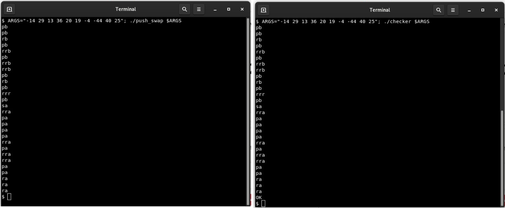
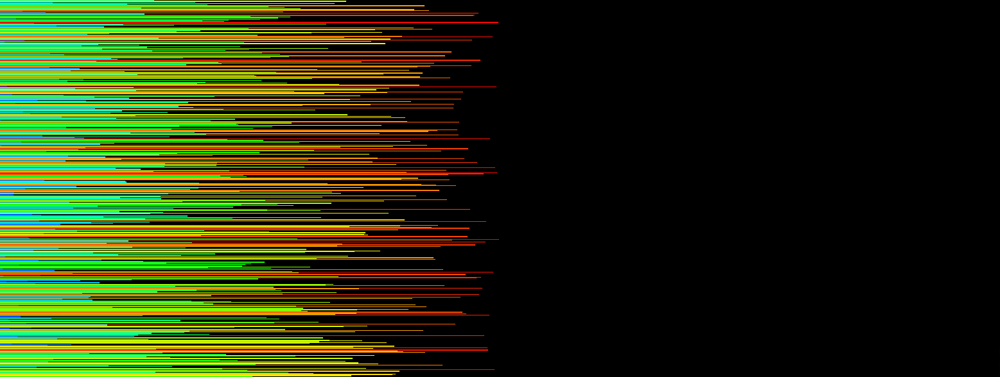

# Push Swap
Push Swap is a project from the 42 School where the objective is to sort a list of numbers using only push, swap, and rotate operations. To accomplish this, two stacks are created, with the list initially inserted into the first stack. The operations function as follows:

- Push: Moves the top element of one stack to the top of the other stack.
- Swap: Swaps the positions of the top two elements in a stack.
- Rotate: Moves the top element to the bottom of the stack.
- Reverse Rotate: Moves the bottom element to the top of the stack.

I did a function to each operation located in the `operations.c` file.

## Algorithm
For this project, I chose to use the Turkish Algorithm due to its efficiency in sorting large lists with minimal movements and its ease of understanding.

To learn more about the Turkish Algorithm, check out this [article](https://medium.com/@ayogun/push-swap-c1f5d2d41e97).

## Project Organization
The project is divided into 6 parts:
1. Validate input arguments.
2. Organize arguments into a linked list (stack).
3. Classify into small or large stack
4. Find the index of the number requiring the fewest operations.
5. Execute the operations.
6. Bring the smallest to the top
Additionally, I used linked lists to represent the stacks. That was very efficient for my chosen algorithm as I could store additional metadata with each number.

#### 1) Validate Input Arguments
In this step, the program verifies that all input arguments are:

- Numbers.
- Unique (no duplicates).
- Within the range of an integer.

The functions for this part are located in the `check_args.c` file.

#### 2) Create Stacks
After validation, the stacks are initialized:

- **Stack A**: Contains the input numbers, with the first argument at the top.
- **Stack B**: Starts as an empty stack.

The functions for this part are located in the `stack_create.c` file.

#### 3) Classify Stacks
If the program receives 2 or 3 arguments it is classified as "Small Stack" and its sorting can be achieved with a maximum of two operations without the need of another stack.
If the program receives more than 3 arguments it is classified as "Large Stack" and it uses two stacks to sort the numbers efficiently.

For larger lists, the algorithm proceeds pushing numbers from **Stack A** to **Stack B** until only three numbers remain in **Stack A**. These three numbers are then sorted directly in **Stack A** as a mall stack.

#### 4) Calculate Steps
The program calculates the number of operations required to:

- Bring both the number to be moved and its target to the top of their respective stacks.
- Perform the push operation.

The target will be the number that needs to be below the number to be moved. In **Stack B**, this will be the closest smaller number (if any) or the largest number. In **Stack A**, this will be the closest larger number (if any) or the smallest number.
Each iteration updates the metadata of each number, storing its target, the number of steps required, and returning the index of the number with the fewest steps. The code for this part is in the `find_target.c` and `calculate_index.c` files.

#### 5) Execute Operations.
Once the number with the fewest steps is identified we:
- Calculate operations based on the number index and its target index.
- Save the number of rotations and reverse rotations of each stack in the **r** struct.
- Perform rotations and reverse rotations.
- Push the number to its target stack.
Now that we have the index, we will calculate the operations again. Based on the number index and its target index we will calculate the number of rotations and reverse rotations in each stack, save this in another struct called "r", execute the rotations, and finally push.
This part's code can be found in the `push_to_stack.c` file.

When **Stack A** is reduced to three numbers, the sorting stops. The small stack is sorted, and numbers are pushed back from **Stack B** to **Stack A**, repeating steps 4 and 5 until **Stack B** is empty.

#### 6) Bring Smallest to the Top
In the final step, the smallest number in **Stack A** is brought to the top using rotations or reverse rotations, completing the sorting process.

## Bonus

In the bonus part of the project, we implemented our checker. This program works as follows:

- It receives arguments just like the push_swap program.
- Instead of performing the operations directly, it reads a sequence of operations provided by the user via standard input.
- When the user finishes inputting operations (signaled by pressing `Ctrl + D`), the checker verifies if the stack is correctly sorted.

The output of the checker is as follows:

- **OK**: The stack is correctly sorted.
- **KO**: The stack is not sorted.
- **Error**: An invalid operation or input was encountered.

This bonus feature allows users to test their sequences of operations and validate their correctness efficiently.

## Executing the Program

To execute the push_swap program, use the `make` command, and to execute the checker program, use the `make bonus` command.

After compiling, you can run the executable `./push_swap $ARGS`, which will print a sequence of commands. To count the number of commands, you can use `./push_swap $ARGS | wc -l`.

To verify if the sequence of commands is correct, execute `./checker $ARGS` and paste the sequence of commands into the input. When finished, press `Ctrl + D` to check the result.

With the help of a visualizer, it is possible to see the program functioning:

